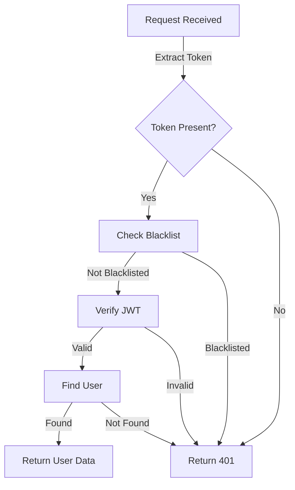
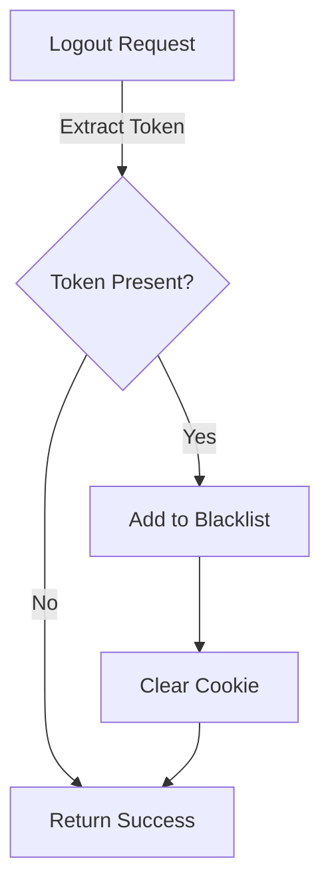
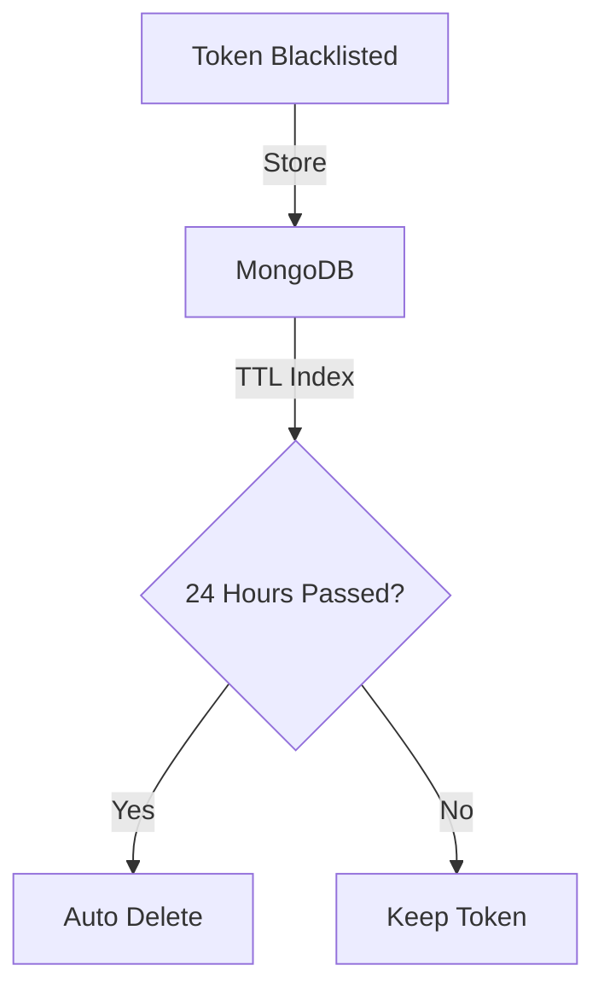

# User Registration API Documentation

## Endpoint
```
POST /users/register
```

## Request Body
```json
{
  "fullname": {
    "firstname": "string", // required, min 3 characters
    "lastname": "string"   // optional, min 3 characters if provided
  },
  "email": "string",       // required, valid email format
  "password": "string"     // required, min 6 characters
}
```

## Response
### Success (200)
```json
{
  "token": "JWT_TOKEN_STRING",
  "user": {
    "_id": "MONGODB_ID",
    "fullname": {
      "firstname": "string",
      "lastname": "string"
    },
    "email": "string",
    "socketId": "string"
  }
}
```

### Error (400)
```json
{
  "errors": [
    {
      "msg": "Error message",
      "param": "field_name",
      "location": "body"
    }
  ]
}
```

## Database Schema
### User Model
- **fullname**
  - firstname (String, required, min: 3 chars)
  - lastname (String, optional, min: 3 chars)
- **email** (String, required, unique, min: 5 chars)
- **password** (String, required, stored as hashed)
- **socketId** (String, optional, for real-time location)

## Security Features
1. Password Hashing
   - Uses bcrypt with salt rounds of 10
   - Password is never stored in plain text

2. JWT Authentication
   - Token generated upon successful registration
   - Uses environment variable SECRET for signing

## Implementation Details

### Validation
- Express-validator middleware checks:
  - Email format
  - Firstname length (min 3 chars)
  - Password length (min 6 chars)

### Database Connection
- MongoDB using Mongoose
- Connection string stored in environment variable: MONGO_CONNECTION_STRING

### Flow
1. Request validation
2. Password hashing
3. User creation in database
4. JWT token generation
5. Response with user data and token

## Environment Variables Required
```
MONGO_CONNECTION_STRING=your_mongodb_connection_string
SECRET=your_jwt_secret_key
```

## Dependencies
- express
- mongoose
- bcrypt
- jsonwebtoken
- express-validator


# User Login API Documentation

## Endpoint
```
POST /users/login
```

---

## Request

### Body Structure

| Field    | Type   | Required | Description                  |
|----------|--------|----------|------------------------------|
| email    | string | Yes      | User's email address         |
| password | string | Yes      | User's password (min 6 chars)|

#### Example
```json
{
  "email": "user@example.com",
  "password": "yourpassword"
}
```

---

## Response

### Success (HTTP 200)

| Field | Type   | Description                    |
|-------|--------|--------------------------------|
| user  | object | User data (excluding password) |
| token | string | JWT authentication token       |

#### Example
```json
{
  "user": {
    "_id": "60f7c2b9e1d2c90017ddc123",
    "fullname": {
      "firstname": "John",
      "lastname": "Doe"
    },
    "email": "user@example.com",
    "socketId": null
  },
  "token": "eyJhbGciOiJIUzI1NiIsInR5cCI6IkpXVCJ9..."
}
```

---

### Error Responses

#### 400 Bad Request (Validation Error)

Occurs when required fields are missing or invalid.

**Example:**
```json
{
  "errors": [
    {
      "msg": "Invalid Email",
      "param": "email",
      "location": "body"
    },
    {
      "msg": "Password must be at least 6 characters long",
      "param": "password",
      "location": "body"
    }
  ]
}
```

#### 401 Unauthorized (Authentication Error)

Occurs when email is not found or password is incorrect.

**Example:**
```json
{
  "message": "Invalid Email or Password"
}
```

---

## Error Handling in Frontend

- **Validation Errors (400):**
  - The response contains an `errors` array.
  - Each error object has `msg`, `param`, and `location`.
  - Example (React):
    ```js
    if (response.status === 400) {
      response.json().then(data => {
        data.errors.forEach(err => alert(err.msg));
      });
    }
    ```

- **Authentication Errors (401):**
  - The response contains a `message` field.
  - Example:
    ```js
    if (response.status === 401) {
      response.json().then(data => alert(data.message));
    }
    ```

---

## Input/Output Types

### Input Type (Request Body)
```typescript
type LoginRequest = {
  email: string;    // required, valid email
  password: string; // required, min 6 characters
}
```

### Output Type (Success Response)
```typescript
type LoginSuccessResponse = {
  user: {
    _id: string;
    fullname: {
      firstname: string;
      lastname?: string;
    };
    email: string;
    socketId?: string;
  };
  token: string;
}
```

### Output Type (Error Response)
```typescript
type LoginErrorResponse =
  | { errors: Array<{ msg: string; param: string; location: string }> }
  | { message: string };
```

---

## Notes

- Passwords are never returned in any response.
- JWT token should be stored securely on the client (e.g., HTTP-only cookie or secure storage).
- Always handle both `errors` and `message` fields in frontend error handling logic.


// ...existing code...

# User Profile API Documentation

## Endpoint
```
GET /users/profile
```

## Authentication
Requires JWT token in one of:
- Authorization header: `Bearer <token>`
- Cookie: `token=<token>`

## Response

### Success (HTTP 200)
```json
{
  "_id": "60f7c2b9e1d2c90017ddc123",
  "fullname": {
    "firstname": "John",
    "lastname": "Doe"
  },
  "email": "user@example.com",
  "socketId": null
}
```

### Error Responses

#### 401 Unauthorized
Occurs when:
- No token provided
- Invalid token
- Expired token
- Blacklisted token

```json
{
  "message": "Unauthorized"
}
```

## Frontend Implementation
```javascript
const getProfile = async () => {
  try {
    const response = await fetch('/users/profile', {
      headers: {
        'Authorization': `Bearer ${localStorage.getItem('token')}`
      }
    });

    if (response.status === 401) {
      // Handle unauthorized access
      const data = await response.json();
      console.error(data.message);
      // Redirect to login
      return;
    }

    const userData = await response.json();
    // Handle user data
  } catch (error) {
    console.error('Failed to fetch profile:', error);
  }
};
```

# User Logout API Documentation

## Endpoint
```
POST /users/logout
```

## Authentication
Requires JWT token in one of:
- Authorization header: `Bearer <token>`
- Cookie: `token=<token>`

## Response

### Success (HTTP 200)
```json
{
  "message": "User Logged Out Succesfuly!"
}
```

### Error Response

#### 401 Unauthorized
```json
{
  "message": "Unauthorized"
}
```

## Frontend Implementation
```javascript
const logout = async () => {
  try {
    const response = await fetch('/users/logout', {
      method: 'POST',
      headers: {
        'Authorization': `Bearer ${localStorage.getItem('token')}`
      }
    });

    if (response.status === 200) {
      // Clear local storage/cookies
      localStorage.removeItem('token');
      // Redirect to login page
    }
  } catch (error) {
    console.error('Logout failed:', error);
  }
};
```

# Token Blacklisting System

## Overview
The system maintains a collection of blacklisted tokens to prevent their reuse after logout.

## Database Schema
```typescript
interface BlackListToken {
  token: string;    // The JWT token to blacklist
  createdAt: Date;  // Automatically set, used for token expiration
}
```

## Features
- Tokens are automatically removed after 24 hours
- Unique index on token field prevents duplicate entries
- Used by auth middleware to validate tokens

## Authentication Middleware

The authentication middleware performs the following checks:

1. Token presence in request
2. Token blacklist status
3. Token validity and signature
4. User existence in database

### Implementation Example
```javascript
// Frontend request with token
const makeAuthenticatedRequest = async (url) => {
  try {
    const response = await fetch(url, {
      headers: {
        'Authorization': `Bearer ${localStorage.getItem('token')}`
      }
    });

    if (response.status === 401) {
      // Token is invalid/expired/blacklisted
      // Redirect to login
      return;
    }

    return await response.json();
  } catch (error) {
    console.error('Request failed:', error);
  }
};
```

## Security Notes
- Tokens are blacklisted immediately upon logout
- Blacklisted tokens are automatically cleaned up after 24 hours
- Both cookie and Authorization header tokens are supported
- All authenticated routes verify token status


# Flow Documentation

## User Profile Flow

### 1. Authentication Flow


### Detailed Steps

1. **Token Extraction**
   ```javascript
   // From Authorization header
   const authHeader = req.headers.authorization; // "Bearer <token>"
   const token = authHeader?.split(' ')[1];

   // OR from cookie
   const token = req.cookies.token;
   ```

2. **Blacklist Check**
   ```javascript
   const isBlackListed = await blackListTokenModel.findOne({ token });
   if (isBlackListed) {
     return res.status(401).json({ message: "Unauthorized" });
   }
   ```

3. **JWT Verification**
   ```javascript
   try {
     const decoded = jwt.verify(token, process.env.SECRET);
     // decoded contains: { _id: "user_id", iat: timestamp, exp: timestamp }
   } catch (error) {
     return res.status(401).json({ message: "Invalid token" });
   }
   ```

4. **User Lookup**
   ```javascript
   const user = await userModel.findById(decoded._id);
   if (!user) {
     return res.status(401).json({ message: "User not found" });
   }
   ```

### Frontend Implementation Flow

```javascript
class AuthService {
  async getProfile() {
    try {
      const response = await fetch('/users/profile', {
        headers: {
          'Authorization': `Bearer ${this.getToken()}`,
          'Content-Type': 'application/json'
        },
        credentials: 'include' // For cookies
      });

      if (!response.ok) {
        throw new Error(`HTTP error! status: ${response.status}`);
      }

      const userData = await response.json();
      return userData;
    } catch (error) {
      this.handleError(error);
      throw error;
    }
  }

  private getToken(): string {
    return localStorage.getItem('token') || '';
  }

  private handleError(error: any) {
    if (error.status === 401) {
      // Clear auth state and redirect to login
      this.logout();
    }
  }
}
```

## Logout Flow

### 1. Server-side Flow


### Detailed Steps

1. **Token Extraction and Validation**
   ```javascript
   const token = req.cookies.token || 
                (req.headers.authorization?.split(' ')[1] || null);
   ```

2. **Blacklist Token**
   ```javascript
   await blackListTokenModel.create({
     token,
     createdAt: new Date() // Auto-expires in 24 hours
   });
   ```

3. **Clear Client Credentials**
   ```javascript
   res.clearCookie("token", {
     httpOnly: true,
     secure: process.env.NODE_ENV === 'production',
     sameSite: 'strict'
   });
   ```

### Frontend Implementation Flow

```javascript
class AuthService {
  async logout() {
    try {
      const token = this.getToken();
      
      const response = await fetch('/users/logout', {
        method: 'POST',
        headers: {
          'Authorization': `Bearer ${token}`,
          'Content-Type': 'application/json'
        },
        credentials: 'include'
      });

      if (!response.ok) {
        throw new Error(`HTTP error! status: ${response.status}`);
      }

      // Clear local storage
      localStorage.removeItem('token');
      
      // Clear any auth state in your app
      this.clearAuthState();

      return true;
    } catch (error) {
      console.error('Logout failed:', error);
      throw error;
    }
  }

  private clearAuthState() {
    // Clear any auth-related state in your application
    // Example with React context:
    // authContext.setState({ user: null, isAuthenticated: false });
  }
}
```

## Token Blacklisting System Flow

### 1. Database Operations


### Implementation Details

1. **Schema Design**
   ```javascript
   const blackListTokenSchema = new mongoose.Schema({
     token: {
       type: String,
       required: true,
       unique: true
     },
     createdAt: {
       type: Date,
       default: Date.now,
       expires: 60 * 60 * 24 // 24 hours in seconds
     }
   });
   ```

2. **Token Validation Process**
   ```javascript
   async function validateToken(token) {
     try {
       // 1. Check if token is blacklisted
       const isBlacklisted = await BlackListToken.findOne({ token });
       if (isBlacklisted) return false;

       // 2. Verify JWT
       const decoded = jwt.verify(token, process.env.SECRET);
       
       // 3. Check user existence
       const user = await User.findById(decoded._id);
       if (!user) return false;

       return true;
     } catch (error) {
       return false;
     }
   }
   ```

### Error Handling Scenarios

1. **Token Already Blacklisted**
   ```javascript
   // Attempting to blacklist same token twice
   try {
     await BlackListToken.create({ token });
   } catch (error) {
     if (error.code === 11000) {
       // Duplicate key error, token already blacklisted
       return res.status(400).json({ 
         message: "Token already invalidated" 
       });
     }
   }
   ```

2. **Invalid Token Format**
   ```javascript
   if (!token || token.split('.').length !== 3) {
     return res.status(401).json({ 
       message: "Invalid token format" 
     });
   }
   ```

### Security Considerations

1. **Token Storage**
   - Store tokens securely using HTTP-only cookies
   - Use secure flag in production
   - Implement CSRF protection

2. **Error Messages**
   - Use generic error messages
   - Don't expose internal errors
   - Log detailed errors server-side

3. **Rate Limiting**
   - Implement rate limiting for auth endpoints
   - Use exponential backoff for failed attempts

4. **Monitoring**
   - Log authentication failures
   - Monitor blacklist size
   - Track token usage patterns